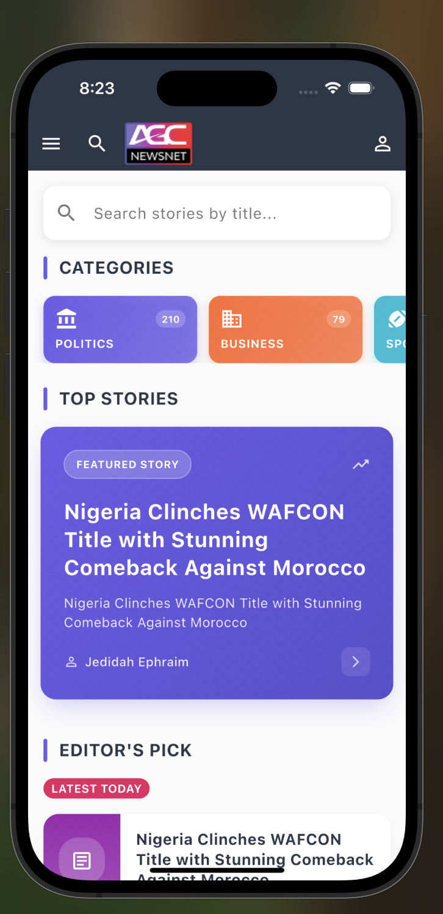
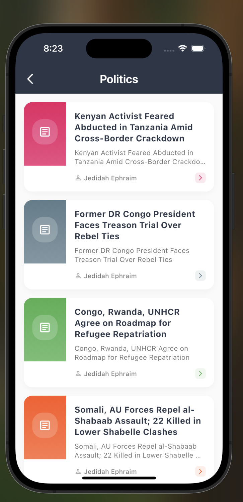
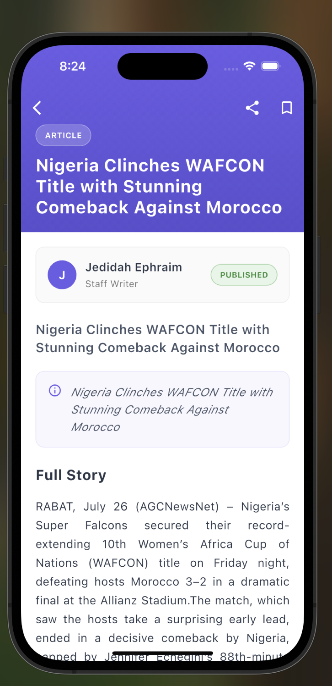
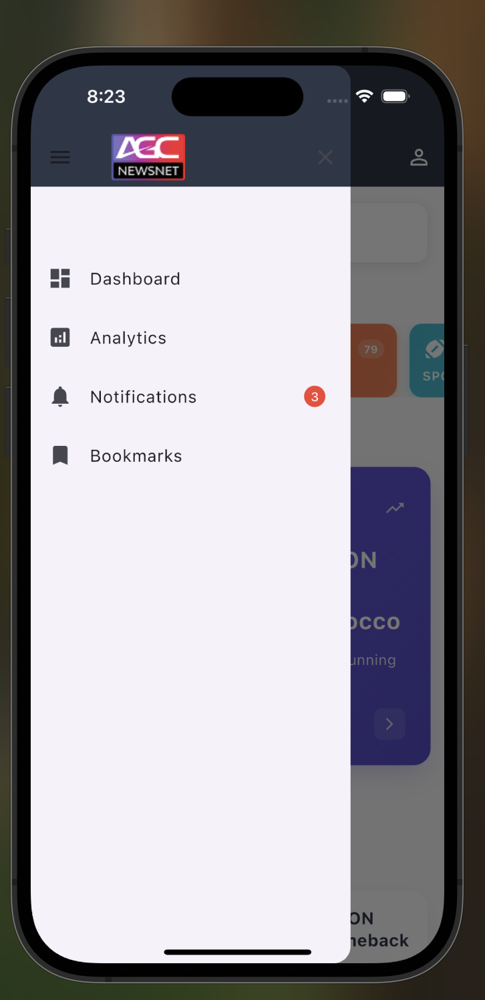

# Flutter News App

A modern, feature-rich news application built with Flutter that provides users with the latest news stories, categorized content, and powerful search functionality.

## Features

-  Browse top stories and editor's picks
-  Real-time search functionality
-  Category-based news filtering
-  Pull-to-refresh support
-  Smooth animations and transitions
-  Clean, modern UI design
-  RESTful API integration

## Screenshots

<!-- Add screenshots of your app here -->
## Screenshots

<div align="center">
  
  
</div>

<div align="center">
  
  
</div>

<div align="center">
  
  
</div>

## Getting Started

### Prerequisites

- Flutter SDK (>=3.0.0)
- Dart SDK (>=3.0.0)
- Android Studio / VS Code with Flutter extensions
- iOS development setup (for iOS deployment)

### Installation

1. **Clone the repository**
   ```bash
   git clone https://github.com/frankolien/flutter-news-app.git
   cd flutter-news-app
   ```

2. **Install dependencies**
   ```bash
   flutter pub get
   ```

3. **Run the app**
   ```bash
   flutter run
   ```

### Project Setup Steps

1. **Environment Setup**
   - Ensure Flutter is properly installed and configured
   - Set up your IDE with Flutter and Dart plugins
   - Configure device/emulator for testing

2. **API Configuration**
   - The app uses AGC News API (`https://api.agcnewsnet.com`)
   - No API key required for basic functionality
   - API endpoints are configured in `lib/core/services/api_service.dart`

3. **Dependencies**
   ```yaml
   dependencies:
     flutter:
       sdk: flutter
     flutter_riverpod: ^2.4.9
     http: ^1.1.0
     # Add other dependencies as needed
   ```

4. **Build for Production**
   ```bash
   # Android
   flutter build apk --release
   
   # iOS
   flutter build ios --release
   ```

## Architecture Overview

This project follows a clean, scalable architecture pattern with clear separation of concerns:

### Directory Structure

```
lib/
├── core/
|__ constants/
│   ├── services/          # API services and external integrations
│   └── utils/             # Utility functions and helpers
├── models/                # Data models and entities
│   ├── news_model.dart
│   └── source_model.dart
├── repositories/          # Data layer abstraction
│   └── news_repository.dart
├── viewmodels/           # Business logic and state management
│   └── home_viewmodel.dart
├── views/                # UI layer
│   ├── screens/          # Main app screens
│   └── widgets/          # Reusable UI components
└── main.dart            # App entry point
```

### Architecture Layers

#### 1. **Presentation Layer** (`views/`)
- **Screens**: Main app pages (HomeView, etc.)
- **Widgets**: Reusable UI components
- **Responsibilities**: UI rendering, user interaction handling, state observation

#### 2. **Business Logic Layer** (`viewmodels/`)
- Contains ViewModels that manage UI state
- Handles business logic and data transformation
- Communicates with repositories to fetch data
- Provides reactive state to UI components

#### 3. **Data Layer** (`repositories/`)
- **Repositories**: Abstract data access and provide clean API to ViewModels
- **Services**: Handle external API calls and data parsing
- **Models**: Define data structures and serialization logic

#### 4. **Core Layer** (`core/`)
- **Services**: Shared services (API client, utilities)
- **Utils**: Helper functions and constants

### Data Flow

```
UI (Views) ↔ ViewModels ↔ Repositories ↔ API Services ↔ External API
```

1. **UI Layer** observes ViewModels for state changes
2. **ViewModels** manage business logic and call repositories
3. **Repositories** abstract data sources and handle caching
4. **Services** make HTTP requests and parse responses
5. **Models** define data structure and validation

## API Integration

The app integrates with AGC News API with the following endpoints:

- `GET /api/general/categories` - Fetch news categories
- `GET /api/general/top-stories` - Fetch top stories
- `GET /api/general/editor-picks` - Fetch editor's pick stories
- `GET /api/general/stories/featured-stories` - Fetch featured stories
- `GET /api/general/categories/{id}/stories` - Fetch stories by category

### Error Handling

- Network connectivity issues
- API response parsing errors
- Loading states with skeleton UI
- Retry mechanisms for failed requests

## Key Features Implementation

### 🔍 **Search Functionality**
- Real-time search filtering
- Searches through titles and descriptions
- Debounced input for performance
- Clear search functionality

### 📱 **Responsive Design**
- Adaptive layouts for different screen sizes
- Material Design principles

### 🔄 **State Management**
- Reactive UI updates
- Efficient re-rendering
- Proper loading and error states

## Testing

```bash
# Run unit tests
flutter test

# Run integration tests
flutter test integration_test/

# Generate coverage report
flutter test --coverage
```

## Contributing

1. Fork the repository
2. Create your feature branch (`git checkout -b feature/amazing-feature`)
3. Commit your changes (`git commit -m 'Add amazing feature'`)
4. Push to the branch (`git push origin feature/amazing-feature`)
5. Open a Pull Request

## Deployment

### Android
```bash
flutter build apk --release
```

### iOS
```bash
flutter build ios --release
```

## License

This project is licensed under the MIT License - see the [LICENSE](LICENSE) file for details.

## Support

If you have any questions or need help with setup, please open an issue in the repository.

## Acknowledgments

- Flutter team for the amazing framework
- Riverpod team for excellent state management
- AGC News API for providing news data
- Material Design for UI guidelines
